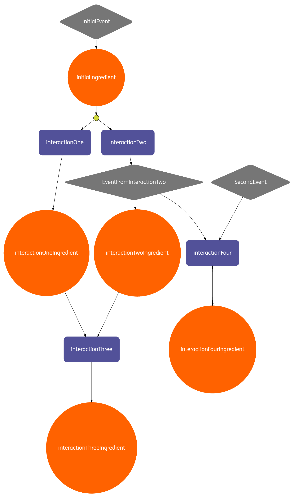

# BAKER 

Baker is a library that reduces the effort to orchestrate (micros)service-based process flows.
Developers declare the orchestration logic in a recipe. 
A recipe is made out of system interactions, ingredients (data) and events. 
A visual representation (shown below) of the recipe allows product owners, architects and developers to talk the same language.





Baker consists of a DSL that allows developers to choose interactions from a catalogue and re-use them in their own recipes. 
Developers can use Java or Scala as a programming language. Each recipe is turned into a [Petri net](https://www.wikiwand.com/en/Petri_net) at runtime.

Petri nets have two interesting mathematical properties that we’d like to explore in the near future:
- **reachability** – can we deliver on a promise (recipe) at all – this will allow developers to check during compile time if the recipe they’ve created makes sense and achieves the desired end state (fulfills the customer order);
- **liveliness** – do we have steps in a recipe that make no sense (unreachable, “dead” code) – this will allow developers to create lean and mean recipes (the less code you write, the less bugs you produce, the less you support);

## How to contribute?

Execute the following commands in your terminal to get started with the development of BAKER.


```
$ git clone https://github.com/ing-bank/baker.git
$ cd Baker
$ sbt
$ compile
```


## Usage 

TBD 

## Dependencies 


TBD 


