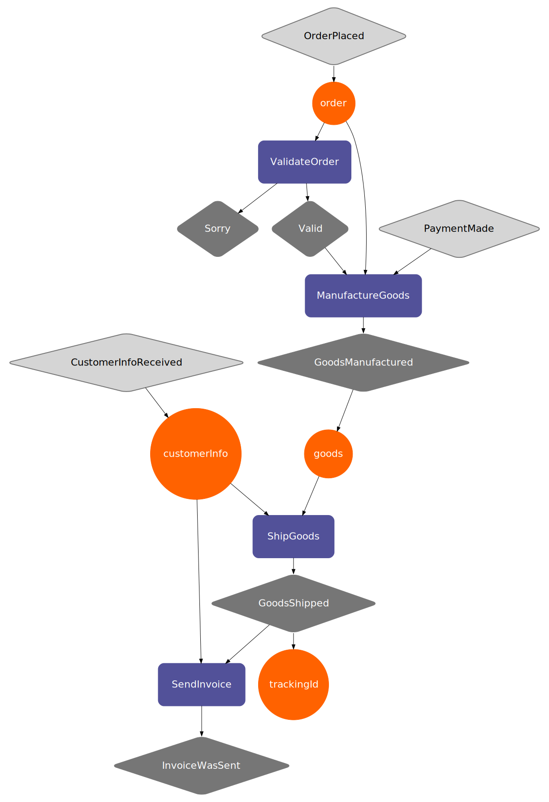

# BAKER

[](https://travis-ci.org/ing-bank/baker)
[](https://maven-badges.herokuapp.com/maven-central/com.ing.baker/baker-runtime_2.12)
[](https://codecov.io/gh/ing-bank/baker?branch=master)


# Overview

Baker is a library that reduces the effort to orchestrate (micro)service-based process flows.
Developers declare the orchestration logic in a recipe.
A recipe is made out of **interactions** (system calls), **ingredients** (data) and **events**.
A visual representation (shown below) of the recipe allows product owners, architects and developers to talk the same language.

An introductory presentation of Baker: [Baker talk @ Amsterdam.Scala meetup](https://www.slideshare.net/BekirOguz/designing-process-flows-with-baker).

A talk about Baker at the Scale By the Bay 2017 conference: [Declare, verify and execute microservices-based process flows](https://www.youtube.com/watch?v=0bWQwUmeXHU).

An example web-shop recipe you can find at: [ExamplesSpec](runtime/src/test/scala/com/ing/baker/runtime/ExamplesSpec.scala) 

WebShop Recipe:
```scala
  val webShopRecipe: Recipe =
    Recipe("WebShop")
      .withInteractions(
        validateOrder,
        manufactureGoods
          .withRequiredEvents(valid, paymentMade),
        shipGoods,
        sendInvoice
          .withRequiredEvent(goodsShipped)
      )
      .withSensoryEvents(
        customerInfoReceived,
        orderPlaced,
        paymentMade)
```
A visual representation of the WebShop recipe looks like the following, where the events are colored in gray, ingredients in orange and interactions in lilac:




Baker consists of a DSL that allows developers to choose interactions from a catalogue and re-use them in their own recipes.
Developers can use Java or Scala as a programming language. Each recipe is turned into a [Petri net](https://www.wikiwand.com/en/Petri_net) at runtime.

Petri nets have two interesting mathematical properties that we’d like to explore in the near future:
- **reachability** – can we deliver on a promise (recipe) at all – this will allow developers to check during compile time if the recipe they’ve created makes sense and achieves the desired end state (fulfills the customer order);
- **liveliness** – do we have steps in a recipe that make no sense (unreachable, “dead” code) – this will allow developers to create lean and mean recipes (the less code you write, the less bugs you produce, the less you support);

# A Catalogue of Reusable Interactions
Let's look at three different products that a bank would sell to customers:

Checking Account | Savings Account | Customer Onboarding
--- | --- | ---
Verify Person's Identity | Verify Person's Identity | Verify Person's Identity
Register Person | Register Person | Register Person
Open *Checking* Account | Open *Savings* Account | `n/a`
Issue Debit Card | `n/a` | `n/a`
Send Message | Send Message | Send Message
Register Product Possession | Register Product Possession | `n/a`

As you can see, there are similarities in the products.

It becomes interesting when you're able to combine the same interactions in different recipes. New functionality can then be built quickly by re-using what's already available.

# How to apply Baker?
Applying Baker will only be successful if you make sure that:
1. You've compared the products your company is selling and there are similarities;
2. You've defined a catalogue of those capabilities necessary to deliver the products from;
3. Each capability (**interaction** in Baker terms) is accessible via an API of any sort (could be a micro-service, web-service, so on);

# Getting Started

To get started with SBT, simply add the following to your build.sbt file:

```
libraryDependencies += "com.ing.baker" %% "baker-recipe-dsl" % "2.0.1"
libraryDependencies += "com.ing.baker" %% "baker-runtime" % "2.0.1"
libraryDependencies += "com.ing.baker" %% "baker-compiler" % "2.0.1"
```

As of 1.3.x we cross compile to both scala 2.11 and 2.12. Earlier releases are only available for 2.11.

# How to contribute?

Execute the following commands in your terminal to get started with the development of Baker.

```
$ git clone https://github.com/ing-bank/baker.git
$ cd baker
$ sbt
> compile
```

# How to visualize your recipe?
Baker can turn a recipe into a DOT representation. It can then be visualized using the following web-site (http://www.webgraphviz.com).

Another way to visualize the recipe is to install [Graphviz](http://www.graphviz.org) on your development machine. On your Mac, install using [brew](https://brew.sh):

```
brew install graphviz
```

To test that all works fine, save the following text in a graph.dot file:

```
digraph d {
A [label="Hello"]
B [label="World"]
C [label="Everyone"]
A -> { B C }
}
```

Assuming you have the graphviz `dot` command you can create an SVG by running:

```
dot -v -Tsvg -O graph.dot
```

Alternatively you can use [graphviz-java](https://github.com/nidi3/graphviz-java) to generate the SVG in your code:

```scala
import guru.nidi.graphviz.engine.{Format, Graphviz}
import guru.nidi.graphviz.parse.Parser

val g = Parser.read(getRecipeVisualization)
Graphviz.fromGraph(g).render(Format.SVG).toString
```


Preview the results:

```
open graph.dot.svg
```

You are all set to visualize your recipes now!

You can also use custom fonts, for more info see <http://www.graphviz.org/doc/fontfaq.txt>.

# References
1. DOT Graph Description Language (https://en.wikipedia.org/wiki/DOT_(graph_description_language)) - explains more about the format Baker uses to produce a graphical representation of the recipe;
2. Order fulfillment (https://en.wikipedia.org/wiki/Order_fulfillment) - gives an idea about the theory behind order fulfillment strategies. As you are in the business of producing and selling products to people, you are in the business of fulfillment;
