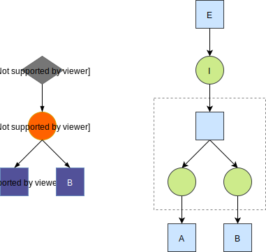
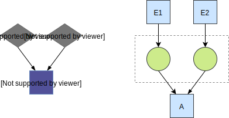
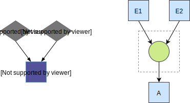

# Recipe compiler

The recipe compiler compiles a recipe specification into a petri net.

### Ingredient used by multiple interactions

Often an ingredient will be used by multiple interactions in a recipe.

Because tokens can only be consumed by 1 transition we have to add a layer to duplicate the token for all transitions.

### Interaction with precondition (AND)

By default event preconditions use an AND combinator. In the petri net this means that each event transition has
to produce a token in a place for that interaction.

### Interaction with precodition (OR)

Events that are grouped in an OR combinator for an interaction output a token to the same place.

Therefor when one of them fires the condition for the transition to fire is met.

### Sensory event with firing limit