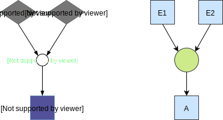

# Recipe Compiler

This documentation is for developers of Bakers and others who might be interested about the internal mechanics.

## Introduction

A recipe can be represented (and [visualization](visualization)) as a graph.

It can be seen as a higher level representation of a petri net (which is also a graph)

The recipe compiler takes a recipe and creates a petri net.

Generally the petri net is graph more complicated with extra layers of wiring nodes.

## Translation rules

The compiler has some rules about translating recipe parts to `transitions` and `places` in the petri net.

### Ingredient used by multiple interactions

Often an ingredient will be used by multiple interactions in a recipe.

Because tokens can only be consumed by 1 transition we have to add a layer to duplicate the token for all transitions.

### Interaction with precondition (AND)

By default event preconditions use an AND combinator. In the petri net this means that each event transition has
to produce a token in a place for that interaction.

### Interaction with precodition (OR)

Events that are grouped in an OR combinator for an interaction output a token to the same place.

Therefor when one of them fires the condition for the transition to fire is met.

### Sensory event with firing limit

When specifying a sensory event with a firing limit of `n` we generate a in-adjacent place with `n` tokens in the
initial marking.

