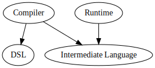

# Getting started

## Project setup

Baker is released to [maven central](https://search.maven.org/search?q=com.ing.baker).

You can add following dependencies to your `maven` or `sbt` project to start using it:

``` scala tab="Sbt"
dependencies += "com.ing.baker" %% "baker-recipe-dsl" % "2.0.1"
dependencies += "com.ing.baker" %% "baker-compiler" % "2.0.1"
dependencies += "com.ing.baker" %% "baker-runtime" % "2.0.1"
```

``` maven tab="Maven"
<dependencies>
   <groupId>com.ing.baker</groupId>
   <artifactId>baker-recipe-dsl_2.12</artifactId>
   <version>2.0.1</version>
</dependencies>
<dependencies>
   <groupId>com.ing.baker</groupId>
   <artifactId>baker-compiler_2.12</artifactId>
   <version>2.0.1</version>
</dependencies>
<dependencies>
   <groupId>com.ing.baker</groupId>
   <artifactId>baker-runtime_2.12</artifactId>
   <version>2.0.1</version>
</dependencies>

```

### Module dependencies



## Developing with baker

After adding the dependencies you can continue to:

 - Familiarize yourself with the [concepts](documentation/concepts.md).
 - Immediately start [writing your recipes](documentation/recipe-dsl.md).