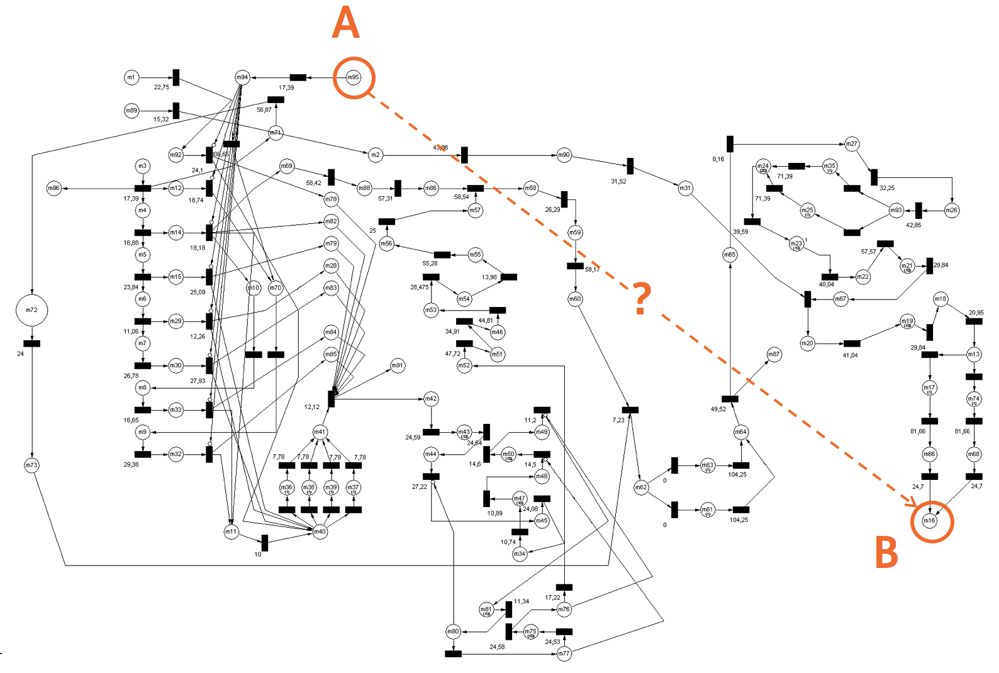
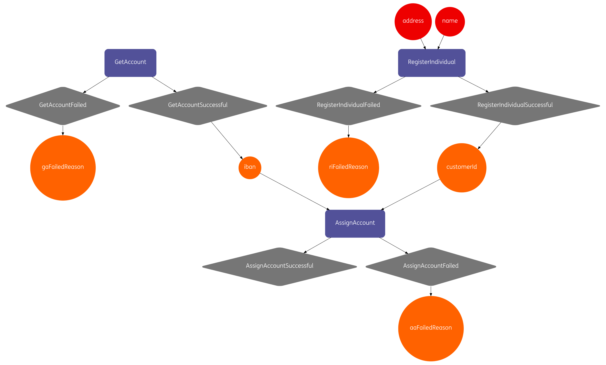

slidenumbers: true
autoscale: true

# Declare, verify and execute microservices-based process flows with Baker
## Scale By the Bay 2017, San Francisco
### Nikola Kasev | ING Bank

---


---


### Global Financial Institution in Over 40 Countries
### **Software Company** with a Banking License
### Microservices Architecture

---

## Our Challenge
### Interact with 12 Different Systems
### A Flow of 27 Steps
### From 2 minutes to 6 hours

---


## Afraid to Change the Application Code

---


## Functionality Breaks Unexpectedly

---


## Slow Time to Market

---

## How to Turn This Around?

---


---


---


## Simplify
### Domain Specific Language for Orchestration Flows
### Declarative
### Easy to Change

---


## Recipes
### Interactions
### Ingredients
### Events

---


## Communicate
### Visualize your code
### Non-IT understand as well
### Reason About Comfortably

---


---


---

## Let's Cook Some Crêpes!

---

## Good to Know

---

### Short-lived vs. long-running flows

---

### State is taken care of:

- Cassandra for persistent storage
- Ingredients encrypted by default
- State recovered automatically

---

### When failure occurs:

- Baker retries technical failures with exponential backoff
- Works well with **idempotent** services
- Deal with functional failure in your recipe

---

Baker Capability Matrix:

- Investigate not one, not two, but **all business processes** in your company
- Where do you see re-use?
- Map using MoSCoW[^4] to give importance (M = 10, S = 5, C = 2, W = 1)

[^4]: https://en.wikipedia.org/wiki/MoSCoW_method

---

| Checking Account | Savings Account | Customer Onboarding |
| :--- | :---: | ---: |
| Verify Identity | Verify Identity | Verify Identity |
| Register Individual | Register Individual | Register Individual |
| Open *Checking* Account | Open *Savings* Account | `n/a` |
| Issue Debit Card | `n/a` | `n/a` |
| Send Message | Send Message | Send Message |
| Register Ownerhip | Register Ownership | `n/a` |

---


## https://github.com/ing-bank/baker

---

### Why Petri net?[^3]

[^3]: https://en.wikipedia.org/wiki/Petri_net

---



---


---


---


---


---


---

## Design-time

---

```scala
val registerIndividual = Interaction(
  name = "RegisterIndividual",
  inputIngredients = Seq(name, address),
  output = Seq(registerIndividualSuccessful, registerIndividualFailed)
)
```

---


---


---


---

```scala
val recipe = Recipe("OpenAccountRecipe")
  .withInteractions(
    assignAccount,
    getAccount,
    registerIndividual)
```

---



---

```scala
val recipe = Recipe("OpenAccountRecipe")
  .withInteractions(
    assignAccount,
    getAccount.withRequiredEvent(termsAndConditionsAccepted),
    registerIndividual)
  .withSensoryEvents(
    termsAndConditionsAccepted,
    individualInformationSubmitted)
```

---


---

## Run-time

---

```scala
//for each process instance, bake the recipe
baker.bake(processId);
//notify Baker when events occur
baker.processEvent(processId, individualInformationSubmitted.instance(name, address));
baker.processEvent(processId, termsAndConditionsAccepted.instance());

//retrieve ingredients stored in the accumulated state
assert(baker.getIngredients(processId).get("customerId").equals(customerId));
assert(baker.getIngredients(processId).get("iban").equals(iban));

//retrieve all events that have occurred
baker.events(processId)
```

---


---

val groceriesDone = new Event("GroceriesDone", Seq(milk, eggs, flour, butter, creme), Some(1))

val mixFirstThree = Interaction(
  name = "MixFirstThree",
  inputIngredients = Seq(milk, eggs, flour),
  output = Seq(batterMixed)
)

val mixFirstThreeImpl = mixFirstThree implement {
  (milk: String, eggs: String, flour: String) =>
    println(s"mixing $milk, $eggs, and $flour")
    batterMixed.instance("batter")
}

---

**I love cooking food** and for the rest of the talk I'll be using examples from there. It's very **similar to our industry**: long hours, hard work, and delivering experiences to our customers.

Have you been woken up at 3 o'clock in the morning on a **Saturday morning** after a night of partying, having to go to the war room and resolve an application incident. I've been there. When I remember the cold of the **airconditioners**, it still **makes me shiver**.

If we are building microservices or a monolith or any type of application in general we are **serving business logic to our clients**. So no matter what, we cannot escape the **architectural discussion**. If we are not careful of how we architect our applications we end up serving a bad meal to our clients.
