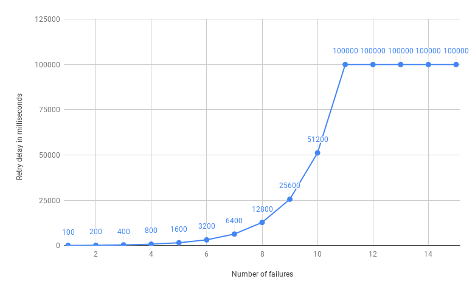

# Error handling

An interaction can fail to achieve its intended purpose. Baker categorizes failures in technical
failures and functional failures.

Technical failures are characterized by the possibility of being retried and
eventually succeeding. Examples of technical failures include timeouts due to an unreliable network, temporary
unavailability of an external system, and receiving an unexpected response from an external system. These failures
are unexpected and are handled by throwing an exception from the interaction.

Functional failures cannot be resolved by retrying the interaction.
Examples of functional failures include cases where there is insufficient stock to ship the order, or there is
insufficient credit to perform a transfer. These failures are anticipated and considered as potential outcomes of the
interaction. They are handled by returning an event from the interaction.

## Failure strategies

Baker offers multiple mitigation strategies for technical failures.

!!! tip
    The examples in this section all set the `defaultFailureStrategy` on `recipe` level. The same strategies are also
    available for the `failureStrategy` on `interaction` level.

### Block interaction

This is the default failure strategy. When an exception occurs the interaction is blocked. This option is suitable
for non-idempotent interactions that cannot be retried.

=== "Java"

    ```java
    --8<-- "docs-code-snippets/src/main/java/examples/java/recipes/RecipeBlockInteraction.java"
    ```

=== "Kotlin"

    ```kotlin
    --8<-- "docs-code-snippets/src/main/kotlin/examples/kotlin/recipes/RecipeBlockInteraction.kt"
    ```

=== "Scala"

    ```scala
    --8<-- "docs-code-snippets/src/main/scala/examples/scala/recipes/RecipeBlockInteraction.scala"
    ```

### Fire event

This option is the equivalent of a `try-catch` in code. When an exception occurs an event is fired. Instead of failing,
the process continues.

=== "Java"

    ```java
    --8<-- "docs-code-snippets/src/main/java/examples/java/recipes/RecipeFireEvent.java"
    ```

=== "Kotlin"

    ```kotlin
    --8<-- "docs-code-snippets/src/main/kotlin/examples/kotlin/recipes/RecipeFireEvent.kt"
    ```

=== "Scala"

    ```scala
    --8<-- "docs-code-snippets/src/main/scala/examples/scala/recipes/RecipeFireEvent.scala"
    ```

### Retry with incremental back-off

Incremental back-off allows you to configure a retry mechanism that exponentially increases the time between each retry.
You retry quickly at first, but slower over time. Retry with incremental back-off keeps retrying until a set deadline
or the maximum amount of retries is reached.

#### Until deadline

=== "Java"

    ```java
    --8<-- "docs-code-snippets/src/main/java/examples/java/recipes/RecipeRetryWithBackOffUntilDeadline.java"
    ```

=== "Kotlin"

    ```kotlin
    --8<-- "docs-code-snippets/src/main/kotlin/examples/kotlin/recipes/RecipeRetryWithBackOffUntilDeadline.kt"
    ```

=== "Scala"

    ```scala
    --8<-- "docs-code-snippets/src/main/scala/examples/scala/recipes/RecipeRetryWithBackOffUntilDeadline.scala"
    ```

#### Until maximum retries

=== "Java"

    ```java
    --8<-- "docs-code-snippets/src/main/java/examples/java/recipes/RecipeRetryWithBackOffUntilMaxRetries.java"
    ```

=== "Kotlin"

    ```kotlin
    --8<-- "docs-code-snippets/src/main/kotlin/examples/kotlin/recipes/RecipeRetryWithBackOffUntilMaxRetries.kt"
    ```

=== "Scala"

    ```scala
    --8<-- "docs-code-snippets/src/main/scala/examples/scala/recipes/RecipeRetryWithBackOffUntilMaxRetries.scala"
    ```


| name                    | meaning                                         |
|-------------------------|-------------------------------------------------|
| `initialDelay`          | The delay before retrying for the first time.   |
| `backoffFactor`         | The backoff factor for the delay, defaults to 2 |
| `maxTimeBetweenRetries` | The maximum time between retries.               |
| `deadLine`              | The total amount of time spend retrying.        |
| `maximumRetries`        | The maximum amount of retries.                  |


Our example results in a retry pattern off: 

`100 millis -> 200 millis -> 400 millis -> ... -> 100 seconds -> 100 seconds`.

Which can be visualized like this:



!!! Note
    Delays do not include the interaction execution time. If the first retry takes 5 seconds (and fails), the second retry will be triggered after:

    `(100 millis + 5 seconds + 200 millis) = 5.3 seconds`

    The deadline also does not consider interaction execution time. Keep this in mind when setting the deadline value.

#### Retry exhaustion
If an interaction keeps failing, the retry is exhausted and the interaction becomes blocked. If you don't want the 
interaction to block after exhausting all the retries, you can continue the process with a predefined event.

=== "Java"

    ```java
    --8<-- "docs-code-snippets/src/main/java/examples/java/recipes/RecipeRetryExhaustedEvent.java"
    ```

=== "Kotlin"

    ```kotlin
    --8<-- "docs-code-snippets/src/main/kotlin/examples/kotlin/recipes/RecipeRetryExhaustedEvent.kt"
    ```

=== "Scala"

    ```scala
    --8<-- "docs-code-snippets/src/main/scala/examples/scala/recipes/RecipeRetryExhaustedEvent.scala"
    ```

## Manual intervention

Baker allows you to resolve blocked interactions, and to stop retrying interactions via manual intervention.

### Force a retry

This method retries a given interaction a single time. If it succeeds, your process continues. If it fails, the interaction
stays blocked.

=== "Java"

    ```java
    --8<-- "docs-code-snippets/src/main/java/examples/java/application/ManualRetryInteraction.java"
    ```

=== "Kotlin"

    ```kotlin
    --8<-- "docs-code-snippets/src/main/kotlin/examples/kotlin/application/ManualRetryInteraction.kt"
    ```

=== "Scala"

    ```scala
    --8<-- "docs-code-snippets/src/main/scala/examples/scala/application/ManualRetryInteraction.scala"
    ```

### Resolve interaction

This method resolves a blocked interaction by firing an event.

=== "Java"

    ```java
    --8<-- "docs-code-snippets/src/main/java/examples/java/application/ManualResolveInteraction.java"
    ```

=== "Kotlin"

    ```kotlin
    --8<-- "docs-code-snippets/src/main/kotlin/examples/kotlin/application/ManualResolveInteraction.kt"
    ```

=== "Scala"

    ```scala
    --8<-- "docs-code-snippets/src/main/scala/examples/scala/application/ManualResolveInteraction.scala"
    ```

### Stop retrying

This method halts the retry process of a failing interaction by blocking the interaction.

=== "Java"

    ```java
    --8<-- "docs-code-snippets/src/main/java/examples/java/application/ManualStopInteraction.java"
    ```

=== "Kotlin"

    ```kotlin
    --8<-- "docs-code-snippets/src/main/kotlin/examples/kotlin/application/ManualStopInteraction.kt"
    ```

=== "Scala"

    ```scala
    --8<-- "docs-code-snippets/src/main/scala/examples/scala/application/ManualStopInteraction.scala"
    ```
