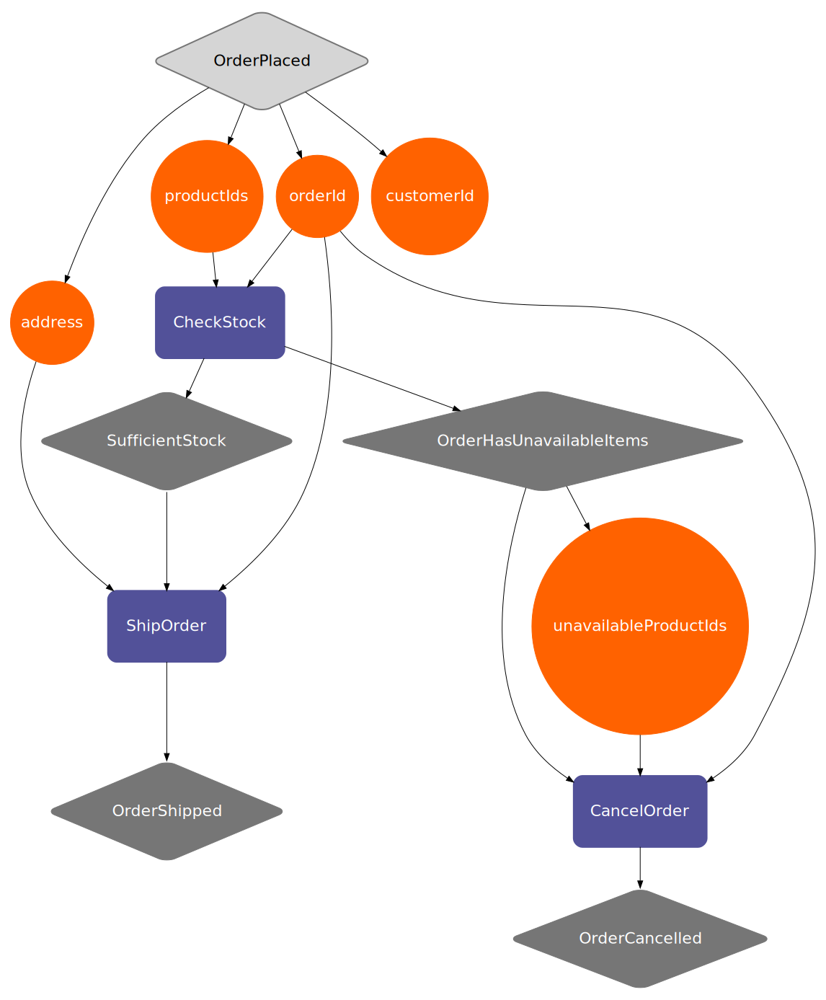
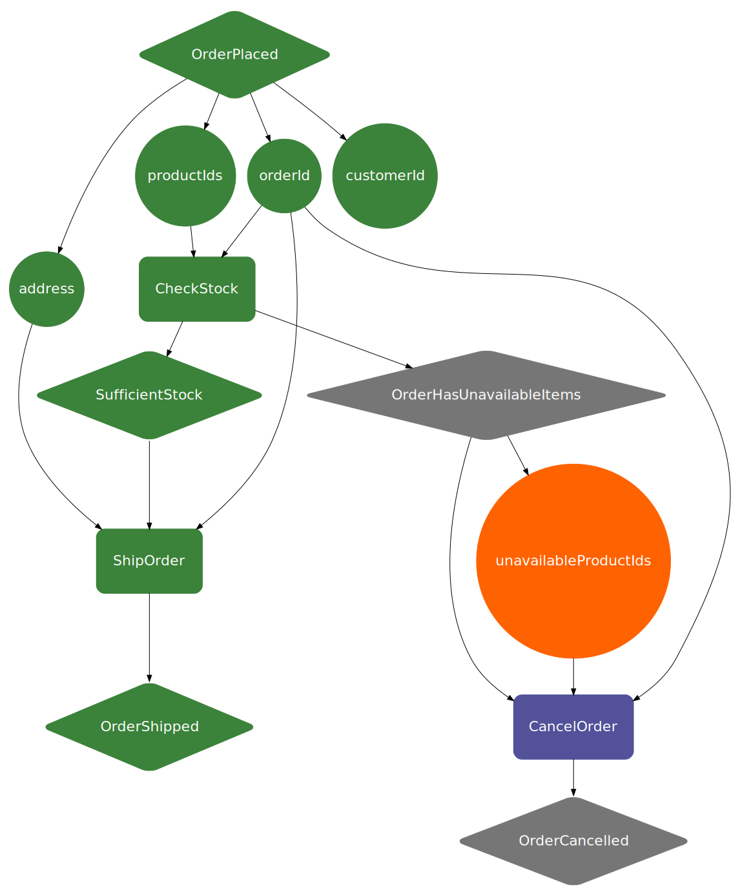

# Visualizations

Bakers ability to visualize recipes provides a powerful communication tool that helps product owners, architects, 
and engineers to have a common understanding of the business process. This feature allows you to easily share your 
recipe with others, enabling collaboration and feedback.

## Visualize a recipe

Baker uses [Graphviz](https://www.graphviz.org/) to visualize recipes. You can generate a Graphviz String from the 
compiled recipe. 

=== "Java"

    ```java
    --8<-- "docs-code-snippets/src/main/java/examples/java/visualization/WebShopVisualization.java"
    ```

=== "Kotlin"

    ```kotlin
    --8<-- "docs-code-snippets/src/main/kotlin/examples/kotlin/visualization/WebShopVisualization.kt"
    ```

=== "Scala"

    ```scala
    --8<-- "docs-code-snippets/src/main/scala/examples/scala/visualization/WebShopVisualization.scala"
    ```

Running the method above, with the `WebShopRecipe` from the [tutorial](../../tutorial) results in the following Graphviz
String:

??? example "Graphviz String"
    ```
    digraph {
        node [fontname = "ING Me", fontsize = 22, fontcolor = white]
        pad = 0.2
        orderId -> CancelOrder
        CancelOrder [shape = rect, style = "rounded, filled", color = "#525199", penwidth = 2, margin = 0.5]
        OrderHasUnavailableItems -> CancelOrder
        address -> ShipOrder
        CheckStock [shape = rect, style = "rounded, filled", color = "#525199", penwidth = 2, margin = 0.5]
        OrderPlaced -> address
        CancelOrder -> OrderCancelled
        CheckStock -> SufficientStock
        orderId [shape = circle, style = filled, color = "#FF6200"]
        orderId -> ShipOrder
        OrderPlaced [shape = diamond, style = "rounded, filled", color = "#767676", fillcolor = "#D5D5D5", fontcolor = black, penwidth = 2, margin = 0.3]
        OrderCancelled [shape = diamond, style = "rounded, filled", color = "#767676", margin = 0.3]
        OrderHasUnavailableItems [shape = diamond, style = "rounded, filled", color = "#767676", margin = 0.3]
        unavailableProductIds -> CancelOrder
        ShipOrder [shape = rect, style = "rounded, filled", color = "#525199", penwidth = 2, margin = 0.5]
        productIds -> CheckStock
        customerId [shape = circle, style = filled, color = "#FF6200"]
        SufficientStock -> ShipOrder
        OrderPlaced -> orderId
        OrderShipped [shape = diamond, style = "rounded, filled", color = "#767676", margin = 0.3]
        orderId -> CheckStock
        OrderPlaced -> customerId
        CheckStock -> OrderHasUnavailableItems
        unavailableProductIds [shape = circle, style = filled, color = "#FF6200"]
        OrderPlaced -> productIds
        ShipOrder -> OrderShipped
        SufficientStock [shape = diamond, style = "rounded, filled", color = "#767676", margin = 0.3]
        productIds [shape = circle, style = filled, color = "#FF6200"]
        address [shape = circle, style = filled, color = "#FF6200"]
        OrderHasUnavailableItems -> unavailableProductIds
    }
    ```

The easiest way to convert the Graphviz string into an image is by using an [online converter](http://www.webgraphviz.com/).

??? example "Web-shop Recipe Visualization"
    

The diamonds are events. Light gray for sensory events, dark gray for output events. Ingredients are shown as orange
circles, and the purple rectangles are interactions. 

!!! tip
    Don't like the default style? It's possible to override the default style by passing an optional `RecipeVisualStyle` 
    argument to `recipe.getRecipeVisualization`. 

## Visualize recipe state

Visualizing the state of a running recipe can also be useful. You can fetch the state visualization of a running (or finished)
recipe via `baker.getVisualState(recipeInstanceId)`. 

??? example "Web-shop recipe instance state visualization"
    