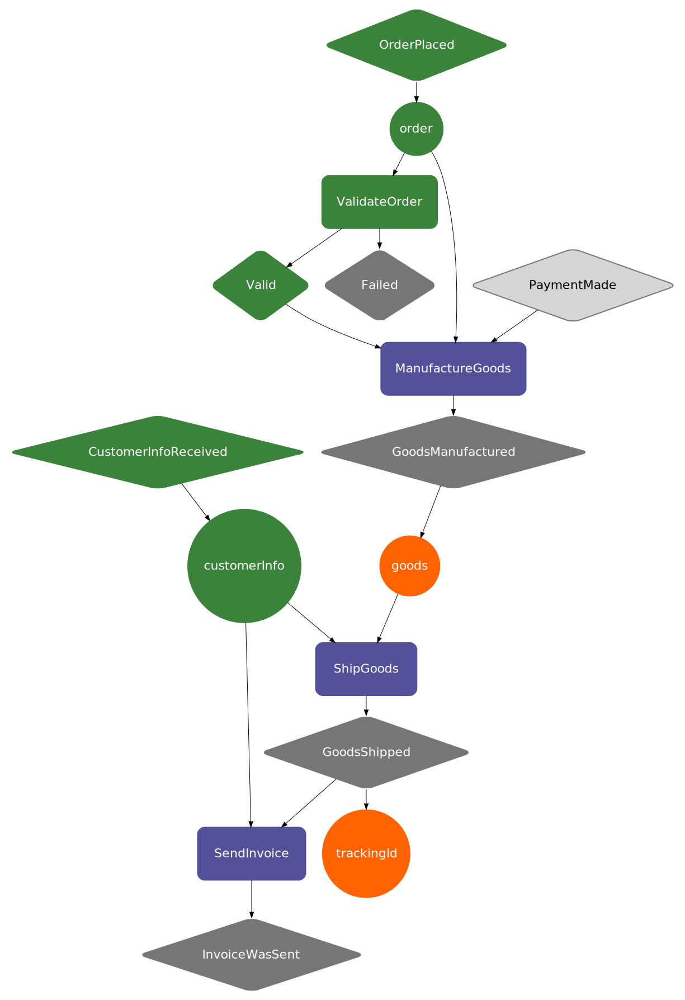

# Bake, Fire Events and Inquiry

At this moment we already have a `Recipe` and `InteractionInstances`, the next step is to create a Baker runtime, and add 
to it the `ImplementationInstances` and the `Recipe` (in that order, since adding a `Recipe` validates that there exist 
valid `InteractionInstances` for each `Interaction`).

For this example we are going to create an Akka-based, non-cluster, local runtime. This runtime is based on a library called
[Akka](https://akka.io/) which helps us manage concurrency and gives us distributed-systems semantics for the cluster mode, 
this is almost completely hidden from you, but currently for some configuration and managing a Baker cluster, it might be 
useful to check the Akka documentation.

Also note that to add a `Recipe` you need to first transform it into a `CompiledRecipe` by using the provided 
`RecipeCompiler.compileRecipe(recipe)` API.

_Note: Since Baker 3.0 all APIs of the runtime are asynchronous by default. That means all APIs return `Future[A]` for 
Scala (IO interface will come in the future depending on demand) and `CompletableFuture<A>` for Java. If you are not familiar 
with these constructs we highly recommend checking one of the many tutorials and documentation pages in the internet, 
otherwise for now you can do `.join` on any `CompletableFuture` or `Await.result(yourFuture, 1.second)` on any `Future`
to block and do normal synchronous/blocking programming._

=== "Scala"

    ```scala 
    import akka.actor.ActorSystem
    import com.ing.baker.compiler.RecipeCompiler
    import com.ing.baker.il.CompiledRecipe
    import com.ing.baker.runtime.scaladsl.EventInstance
    import com.ing.baker.runtime.akka.AkkaBaker

    import scala.concurrent.{Await, Future}
    import scala.concurrent.duration._
    import scala.concurrent.ExecutionContext.Implicits.global


    implicit val actorSystem: ActorSystem =
      ActorSystem("WebshopSystem")

    val baker: Baker = AkkaBaker.akkaLocalDefault(actorSystem)

    val compiledRecipe: CompiledRecipe = RecipeCompiler.compileRecipe(WebshopRecipe.recipe)

    val program: Future[Unit] = for {
      _ <- baker.addInteractionInstance(WebshopInstancesReflection.reserveItemsInstance)
      recipeId <- baker.addRecipe(compiledRecipe)
    } yield ()

    ```

=== "Java"

    ```java 
    import akka.actor.ActorSystem;
    import com.ing.baker.compiler.RecipeCompiler;
    import com.ing.baker.il.CompiledRecipe;
    import com.ing.baker.runtime.akka.AkkaBaker;
    import com.ing.baker.runtime.javadsl.InteractionInstance;

    import java.util.concurrent.CompletableFuture;

    public class JMain {

        static public void main(String[] args) {

            ActorSystem actorSystem = ActorSystem.create("WebshopSystem");
            Baker baker = AkkaBaker.javaLocalDefault(actorSystem);

            InteractionInstance reserveItemsInstance = InteractionInstance.from(new ReserveItems());
            CompiledRecipe compiledRecipe = RecipeCompiler.compileRecipe(JWebshopRecipe.recipe);

            CompletableFuture<String> asyncRecipeId = baker.addInteractionInstance(reserveItemsInstance)
                .thenCompose(ignore -> baker.addRecipe(compiledRecipe));

            // Blocks, not recommended but useful for testing or trying things out
            String recipeId = asyncRecipeId.join();
        }
    }
    ```

## Bake

Next, you can start one instance of your process by `baking` a recipe, this will internally create a `RecipeInstance`
which will hold the state of your process, listen to `EventInstances`, execute your `InteractionInstances` when 
`IngredientInstances` are available and handle any failure state. 

`RecipeInstances` can be created by choosing a `CompiledRecipe` by using the `recipeId` yielded by the 
`Baker.addRecipe(compiledRecipe)` API, and by providing a `recipeInstanceId` of your choosing; you will use this last id
to reference and interact with the created `RecipeInstance`. Use the `Baker.bake(recipeId, recipeInstanceId)` API for 
creating a `RecipeInstance`.

_Note: In an Akka-cluster-based Baker, these `RecipeInstances` are also automatically distributed over nodes, and the 
cluster will ensure that there is 1 `RecipeInstance` running on 1 node, and if the node dies, it will detect it and 
restore the `RecipeInstance` in another available node, for this you need to configure an underlying distributed store;
for more on this please refer to the [configuration section](../../development-life-cycle/configure/) and the [runtime section](../../reference/runtime/)._

=== "Scala"

    ```scala 
    import akka.actor.ActorSystem
    import com.ing.baker.compiler.RecipeCompiler
    import com.ing.baker.il.CompiledRecipe
    import com.ing.baker.runtime.scaladsl.EventInstance
    import com.ing.baker.runtime.akka.AkkaBaker

    import scala.concurrent.{Await, Future}
    import scala.concurrent.duration._
    import scala.concurrent.ExecutionContext.Implicits.global


    implicit val actorSystem: ActorSystem =
      ActorSystem("WebshopSystem")
    val baker: Baker = AkkaBaker.localDefault(actorSystem)

    val compiledRecipe: CompiledRecipe = RecipeCompiler.compileRecipe(WebshopRecipe.recipe)

    val program: Future[Unit] = for {
      _ <- baker.addInteractionInstance(WebshopInstancesReflection.reserveItemsInstance)
      recipeId <- baker.addRecipe(compiledRecipe)
      _ <- baker.bake(recipeId, "first-instance-id")
    } yield ()

    ```

=== "Java"

    ```java 
    import akka.actor.ActorSystem;
    import com.ing.baker.compiler.RecipeCompiler;
    import com.ing.baker.il.CompiledRecipe;
    import com.ing.baker.runtime.akka.AkkaBaker;
    import com.ing.baker.runtime.javadsl.InteractionInstance;

    import java.util.concurrent.CompletableFuture;

    // As a small quirk ok the Java API, all operations which are ment to not return something, will return a 
    // scala.runtime.BoxedUnit object. You should think of it like Java's Void or void and you can safely
    // ignore it except for your type signatures.
    import scala.runtime.BoxedUnit;

    public class JMain {

        static public void main(String[] args) {

            ActorSystem actorSystem = ActorSystem.create("WebshopSystem");
            Baker baker = AkkaBaker.javaLocalDefault(actorSystem);

            InteractionInstance reserveItemsInstance = InteractionInstance.from(new ReserveItems());
            CompiledRecipe compiledRecipe = RecipeCompiler.compileRecipe(JWebshopRecipe.recipe);

            CompletableFuture<BoxedUnit> asyncRecipeId = baker.addInteractionInstance(reserveItemsInstance)
                .thenCompose(ignore -> baker.addRecipe(compiledRecipe))
                .thenCompose(recipeId -> baker.bake(recipeId, recipeInstanceId));
        }
    }
    ```

## Fire Events

Next, we want our process to start flowing through it's state, and start executing `InteractionInstances`, for that we
need to fire the nicknamed `SensoryEvents` which are just `EventInstances` which match the root `Events` from our `Recipe`.

There are several supported semantics for firing an event. When you fire an event you might want to be notified and continue your 
asynchronous computation on 1 of 4 different moments:

1. When the event got accepted by the `RecipeInstance` but has not started cascading the execution of `InteractionInstances`. 
For this use the `Baker.fireEventAndResolveWhenReceived(recipeInstanceId, eventInstance)` API. This will return a 
`Future[SensoryEventStatus]` enum notifying of the outcome (the event might get rejected).

2. When the event got accepted by the `RecipeInstance` and has finished cascading the execution of `InteractionInstances`
up to the point that it requires more `EventInstances` (`SensoryEvents`) to continue, or the process has finished.
For this use the `Baker.fireEventAndResolveWhenCompleted(recipeInstanceId, eventInstance)` API. This will return a 
`Future[EventResult]` object containing a `SensoryEventStatus`, the `Event` names that got fired in consequence of this 
`SensoryEvent`, and the current available `Ingredients` output of the `InteractionInstances` that got executed as consequence 
of the `SensoryEvent`.

3. You want to do something on both of the previously mentioned moments, then use the 
`Baker.fireEvent(recipeInstanceId, eventInstance)` API, which will return an `EventResolutions` object which contains both
`Future[SensoryEventStatus]` and `Future[EventResult]` (or its `CompletableFuture<A>` equivalents in Java).

4. As soon as an intermediate `Event` fires from one of the `InteractionInstances` that execute as consequence of the fired
`SensoryEvent`. For this use the `Baker.fireEventAndResolveOnEvent(recipeInstanceId, eventInstance, onEventName)` API. This will return 
a similar `Future[EventResult` to the one returned by `Baker.fireEventAndResolveWhenCompleted` except the data will be up
to the moment the `onEventName` was fired.

=== "Scala"

    ```scala 
    import akka.actor.ActorSystem
    import com.ing.baker.compiler.RecipeCompiler
    import com.ing.baker.il.CompiledRecipe
    import com.ing.baker.runtime.scaladsl.EventInstance
    import com.ing.baker.runtime.akka.AkkaBaker

    import scala.concurrent.{Await, Future}
    import scala.concurrent.duration._
    import scala.concurrent.ExecutionContext.Implicits.global


    implicit val actorSystem: ActorSystem =
      ActorSystem("WebshopSystem")
    val baker: Baker = AkkaBaker.localDefault(actorSystem)

    val compiledRecipe: CompiledRecipe = RecipeCompiler.compileRecipe(WebshopRecipe.recipe)

    val program: Future[Unit] = for {
      _ <- baker.addInteractionInstance(WebshopInstancesReflection.reserveItemsInstance)
      recipeId <- baker.addRecipe(compiledRecipe)
      _ <- baker.bake(recipeId, "first-instance-id")
      firstOrderPlaced: EventInstance =
        EventInstance.unsafeFrom(WebshopRecipeReflection.OrderPlaced("order-uuid", List("item1", "item2")))
      result <- baker.fireEventAndResolveWhenCompleted("first-instance-id", firstOrderPlaced)
      _ = assert(result.events == Seq(
        WebshopRecipe.Events.OrderPlaced.name,
        WebshopRecipe.Events.ItemsReserved.name
      )
    } yield ()

    ```

=== "Java"

    ```java 
    import akka.actor.ActorSystem;
    import com.ing.baker.compiler.RecipeCompiler;
    import com.ing.baker.il.CompiledRecipe;
    import com.ing.baker.runtime.akka.AkkaBaker;
    import com.ing.baker.runtime.javadsl.EventInstance;
    import com.ing.baker.runtime.javadsl.EventResult;
    import com.ing.baker.runtime.javadsl.InteractionInstance;

    import java.util.ArrayList;
    import java.util.List;
    import java.util.concurrent.CompletableFuture;

    public class JMain {

        static public void main(String[] args) {

            ActorSystem actorSystem = ActorSystem.create("WebshopSystem");
            Baker baker = AkkaBaker.javaLocalDefault(actorSystem);

            List<String> items = new ArrayList<>(2);
            items.add("item1");
            items.add("item2");
            EventInstance firstOrderPlaced =
                EventInstance.from(new JWebshopRecipe.OrderPlaced("order-uuid", items));

            InteractionInstance reserveItemsInstance = InteractionInstance.from(new ReserveItems());
            CompiledRecipe compiledRecipe = RecipeCompiler.compileRecipe(JWebshopRecipe.recipe);

            String recipeInstanceId = "first-instance-id";
            CompletableFuture<List<String>> result = baker.addInteractionInstance(reserveItemsInstance)
                .thenCompose(ignore -> baker.addRecipe(compiledRecipe))
                .thenCompose(recipeId -> baker.bake(recipeId, recipeInstanceId))
                .thenCompose(ignore -> baker.fireEventAndResolveWhenCompleted(recipeInstanceId, firstOrderPlaced))
                .thenApply(EventResult::events);

            List<String> blockedResult = result.join();
            assert(blockedResult.contains("OrderPlaced") && blockedResult.contains("ReservedItems"));
        }
    }
    ```

## Inquiry

### Recipe Instance State

As a final step on what you might want to do with Baker (without considering handling failed `RecipeInstances`),
is that you can query the state of a `RecipeInstance` at any given moment. For this you can use the 
`Baker.getInteractionInstanceState(recipeInstanceId)` API. This will return an `InteractionInstanceState` object which 
contains all the event names with timestamps that have executed, and the current available provided ingredients waiting 
for the next `InteractionInstances` to consume.

### Recipe Instance State Visualizations

Another method of fetching state is the visual representation of it. You can do that with the `Baker.getVisualState(recipeInstanceId)`
API. This will return a GraphViz string like the [visualization api](../../development-life-cycle/use-visualizations/) that you can convert into an image.

Here is a visualization of the state of another webshop example, one can clearly see that the process is flowing correctly
without failures and that it is still waiting for the payment sensory event to be fired.


