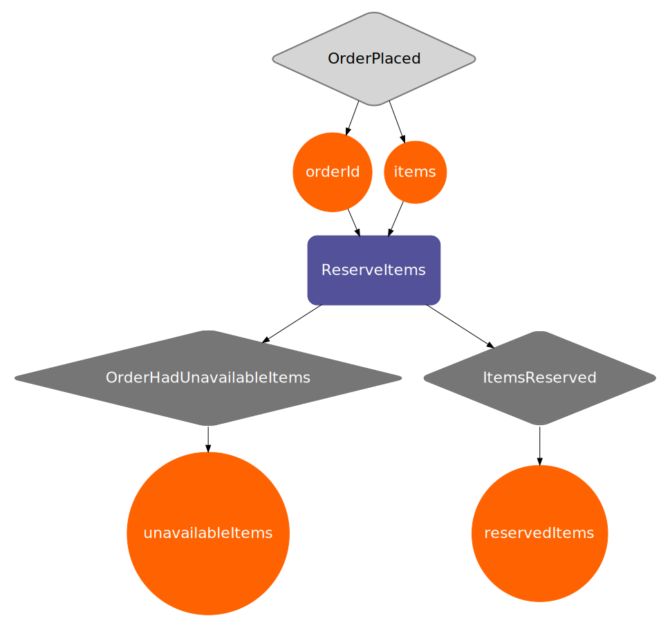

# Use Visualizations

One of the first big advantages of creating Baker recipes is visualization.
 
We have found that the visualization creates a great way to reason on very complex and big processes, and also they 
create a bridge between developers and business oriented people.

You can generate one from a compiled recipe.

=== "Scala"

    ```scala 

    import com.ing.baker.il.CompiledRecipe
    import com.ing.baker.compiler.RecipeCompiler

    val compiled = RecipeCompiler.compileRecipe(WebshopRecipe.recipe)
    val visualization: String = compiled.getRecipeVisualization

    ```

=== "Java"

    ```java 

    import com.ing.baker.il.CompiledRecipe;
    import com.ing.baker.compiler.RecipeCompiler;

    CompiledRecipe recipe = RecipeCompiler.compileRecipe(JWebshopRecipe.recipe);
    String visualization = recipe.getRecipeVisualization();

    ```

The visualization is a [graphviz](http://www.graphviz.org/) string that will look like this:

```
digraph {
	node [fontname = "ING Me", fontsize = 22, fontcolor = white]
	pad = 0.2
	ReserveItems [shape = rect, style = "rounded, filled", color = "#525199", penwidth = 2, margin = 0.5]
	reservedItems [shape = circle, style = filled, color = "#FF6200"]
	OrderHadUnavailableItems [shape = diamond, style = "rounded, filled", color = "#767676", margin = 0.3]
	unavailableItems [shape = circle, style = filled, color = "#FF6200"]
	orderId [shape = circle, style = filled, color = "#FF6200"]
	OrderPlaced [shape = diamond, style = "rounded, filled", color = "#767676", fillcolor = "#D5D5D5", fontcolor = black, penwidth = 2, margin = 0.3]
	ReserveItems -> OrderHadUnavailableItems
	OrderHadUnavailableItems -> unavailableItems
	OrderPlaced -> items
	OrderPlaced -> orderId
	items -> ReserveItems
	ItemsReserved [shape = diamond, style = "rounded, filled", color = "#767676", margin = 0.3]
	orderId -> ReserveItems
	items [shape = circle, style = filled, color = "#FF6200"]
	ReserveItems -> ItemsReserved
	ItemsReserved -> reservedItems
}
```

You can use tools like [this web page](http://www.webgraphviz.com/) to create an svg image. For example the visualization of 
the Webshop recipe that we designed on the last section looks like this:



For complete documentation of how to configure the visualization, refer to [this section](../../reference/visualization/).