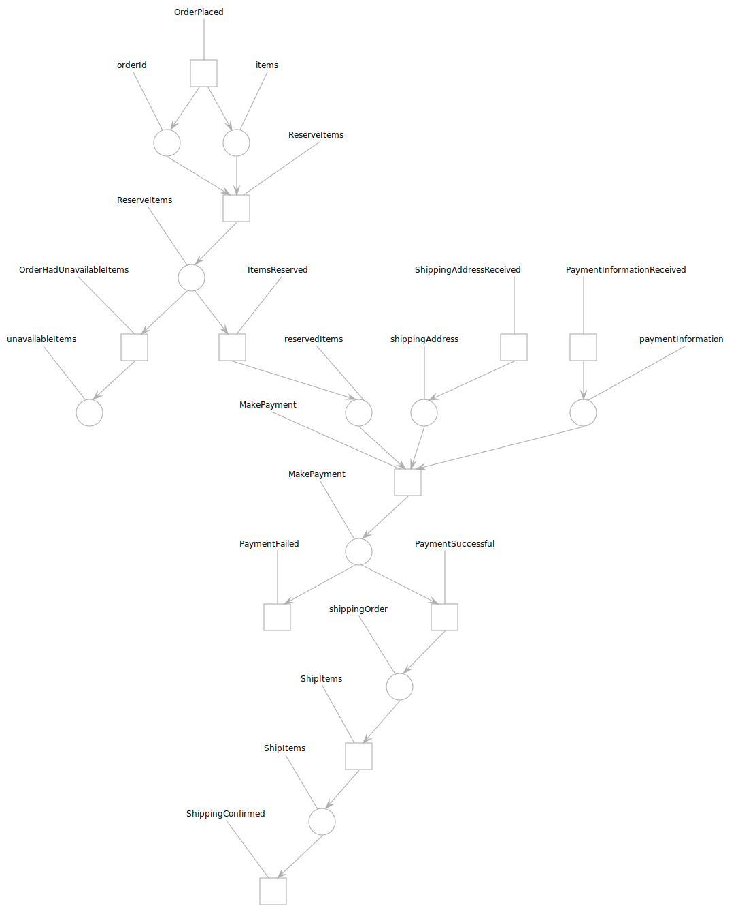

# Validate a recipe

Baker is internally built on [Petri Nets](https://en.wikipedia.org/wiki/Petri_net).
One of the big advantages of creating Petri Nets is that they can be analyzed and validated in a variety of ways.
In order to do this in Baker, you can create an export in the [PNML](https://en.wikipedia.org/wiki/Petri_Net_Markup_Language)
(Petri Net Markup Language) file format and then analyzed in a [variety of tools](http://www.pnml.org/tools.php).
 
We have found that the visualization creates a great way to reason on very complex and big processes, and also they 
create a bridge between developers and business oriented people.

You can generate one from a compiled recipe.

``` scala tab="Scala"

import com.ing.baker.il.CompiledRecipe
import com.ing.baker.il.pnml.RecipePnmlExporter
import com.ing.baker.compiler.RecipeCompiler
import java.io._

val compiled = RecipeCompiler.compileRecipe(WebshopRecipe.recipe)
val pnml: String = RecipePnmlExporter.exportToPnml(compiled.petriNet)
val pw = new PrintWriter(new File("export.pnml"))
pw.write(pnml)
pw.close

```

``` scala tab="Java"

import com.ing.baker.il.CompiledRecipe;
import com.ing.baker.il.pnml.RecipePnmlExporter;
import com.ing.baker.compiler.RecipeCompiler;
import java.io.*;

CompiledRecipe compiled = RecipeCompiler.compileRecipe(JWebshopRecipe.recipe);
String pnml = RecipePnmlExporter.exportToPnml(compiled.petriNet());
PrintWriter pw = new PrintWriter(new File("export.pnml"));
pw.write(pnml);
pw.close();

```

You can use tools like [ePNK](http://www.imm.dtu.dk/~ekki/projects/ePNK/index.shtml) to load the exported PNML and e.g. create an svg image. For example the visualization of 
the Webshop recipe that we designed on the last section looks like this:



