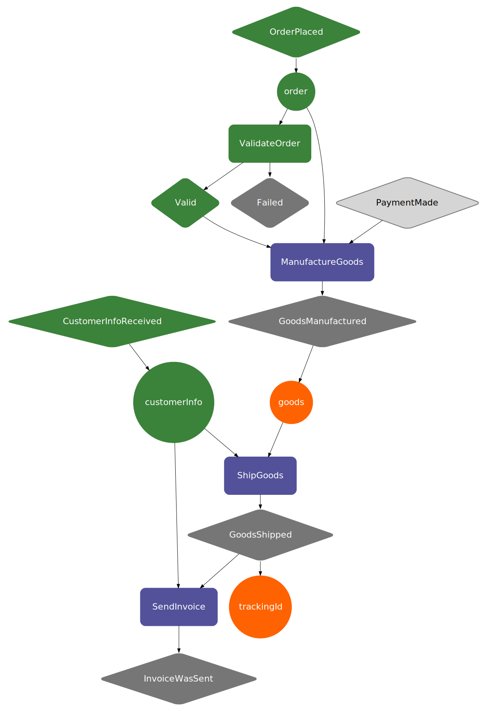

# Visualization

A visualization is a visual graph representation of a Recipe and it is built from a compiled recipe.

You can see an example of the output and of a rendered visualization [here](../../development-life-cycle/use-visualizations).

``` scala tab="Scala"

import com.ing.baker.il.CompiledRecipe
import com.ing.baker.compiler.RecipeCompiler

val compiled = RecipeCompiler.compileRecipe(WebshopRecipe.recipe)
val visualization: String = compiled.getRecipeVisualization

```

``` scala tab="Java"

import com.ing.baker.il.CompiledRecipe;
import com.ing.baker.compiler.RecipeCompiler;

CompiledRecipe recipe = RecipeCompiler.compileRecipe(JWebshopRecipe.recipe);
String visualization = recipe.getRecipeVisualization();

```

The aesthetics can be configured by passing a `com.ing.baker.il.RecipeVisualStyle` object to the 
`recipe.getRecipeVisualization()` method, that object has `scalax.collection.io.dot._` objects that will change how
 your ingredients, events and interactions are rendered. 
 
 The default configuration is:

``` scala tab="Scala"

case class RecipeVisualStyle(

  rootAttributes: List[DotAttr] = List(
    DotAttr("pad", 0.2)
  ),

  commonNodeAttributes: List[DotAttrStmt] = List(
    DotAttrStmt(
      Elem.node,
      List(
        DotAttr("fontname", "ING Me"),
        DotAttr("fontsize", 22),
        DotAttr("fontcolor", "white")
      )
    )
  ),

  ingredientAttributes: List[DotAttr] = List(
    DotAttr("shape", "circle"),
    DotAttr("style", "filled"),
    DotAttr("color", "\"#FF6200\"")
  ),

  providedIngredientAttributes: List[DotAttr] = List(
    DotAttr("shape", "circle"),
    DotAttr("style", "filled"),
    DotAttr("color", "\"#3b823a\"")
  ),

  missingIngredientAttributes: List[DotAttr] = List(
    DotAttr("shape", "circle"),
    DotAttr("style", "filled"),
    DotAttr("color", "\"#EE0000\""),
    DotAttr("penwidth", "5.0")
  ),

  eventAttributes: List[DotAttr] = List(
    DotAttr("shape", "diamond"),
    DotAttr("style", "rounded, filled"),
    DotAttr("color", "\"#767676\""),
    DotAttr("margin", 0.3D)
  ),

  sensoryEventAttributes: List[DotAttr] = List(
    DotAttr("shape", "diamond"),
    DotAttr("style", "rounded, filled"),
    DotAttr("color", "\"#767676\""),
    DotAttr("fillcolor", "\"#D5D5D5\""),
    DotAttr("fontcolor", "black"),
    DotAttr("penwidth", 2),
    DotAttr("margin", 0.3D)
  ),

  interactionAttributes: List[DotAttr] = List(
    DotAttr("shape", "rect"),
    DotAttr("style", "rounded, filled"),
    DotAttr("color", "\"#525199\""),
    DotAttr("penwidth", 2),
    DotAttr("margin", 0.5D),
  ),

  eventFiredAttributes: List[DotAttr] = List(
    DotAttr("shape", "diamond"),
    DotAttr("style", "rounded, filled"),
    DotAttr("color", "\"#3b823a\""),
    DotAttr("margin", 0.3D)
  ),

  firedInteractionAttributes: List[DotAttr] = List(
    DotAttr("shape", "rect"),
    DotAttr("style", "rounded, filled"),
    DotAttr("color", "\"#3b823a\""),
    DotAttr("penwidth", 2),
    DotAttr("margin", 0.5D),
  ),

  eventMissingAttributes: List[DotAttr] = List(
    DotAttr("shape", "diamond"),
    DotAttr("margin", 0.3D),
    DotAttr("style", "rounded, filled"),
    DotAttr("color", "\"#EE0000\""),
    DotAttr("penwidth", "5.0")
  ),

  choiceAttributes: List[DotAttr] = List(
    DotAttr("shape", "point"),
    DotAttr("fillcolor", "\"#D0D93C\""),
    DotAttr("width", 0.3),
    DotAttr("height", 0.3)
  ),

  emptyEventAttributes: List[DotAttr] = List(
    DotAttr("shape", "point"),
    DotAttr("fillcolor", "\"#D0D93C\""),
    DotAttr("width", 0.1),
    DotAttr("height", 0.1)
  ),

  preconditionORAttributes: List[DotAttr] = List(
    DotAttr("shape", "circle"),
    DotAttr("fillcolor", "\"#D0D93C\""),
    DotAttr("fontcolor", "black"),
    DotAttr("label", "OR"),
    DotAttr("style", "filled")
  ),

  // this will be removed soon
  sieveAttributes: List[DotAttr] = List(
    DotAttr("shape", "rect"),
    DotAttr("margin", 0.5D),
    DotAttr("color", "\"#7594d6\""),
    DotAttr("style", "rounded, filled"),
    DotAttr("penwidth", 2)
  )
)

```

## Recipe Instance State Visualizations

Another type of visualization that can be done is the `Baker.getVisualState(recipeInstanceId)` API, this will generate the
same GraphViz string but of the state of a currently running `ProcessInstance`, referenced by the input recipeInstanceId.


